## Google Data Analytics Case 1: Cyclistic
- by Kongsakun Panyang
- Email: balliolon@gmail.com
- LinkedIn: www.linkedin.com/in/kongsakun-panyang-b35029230
- GitHub: https://github.com/balliolon2

## Introduction
- This project is a part of "Google Data Analytics" course on Coursera.
- Follow to Google Data Analytics processes
  - Asking, Preparing, Processing, Analysis, Sharing, Acting

## Asking
- #### Scenario
  - You are a junior data analyst 
  - working in the marketing analyst team 
    - at Cyclistic, a bike-share company in Chicago
  - Director of marketing
    - the company’s future success 
      - depends on maximizing the number of annual memberships
  - Task
    - design a new marketing strategy 
      - to convert casual riders into annual members
- #### Problem
  - How to increase the number of annual members?
- #### Question
  - What are factors that increase the number of annual members?
  - How to design?

## Preparing
- #### Resource
  - Open data
    - https://divvy-tripdata.s3.amazonaws.com/index.html
- #### How they are organized
  - date
- #### Bias?
  - No
    - datas are come from users 
        - might be automatically recored
- #### ROCCC?
  - Yes
  - reliable, original, comprehensive, current, & cited

## Processing
- Organize data by Python
- Data visualize by Python, Tableau

#### Import Libraries and datas


```python
import numpy as np # for linear algebra and operation
import pandas as pd # for dataframe
import matplotlib.pyplot as plt # for data visualization
import seaborn as sns # for data visualization
from collections import Counter # for count value
%matplotlib inline
```


```python
#import files
data_m1 = pd.read_csv('202101-divvy-tripdata.csv')
data_m2 = pd.read_csv('202102-divvy-tripdata.csv')
data_m3 = pd.read_csv('202103-divvy-tripdata.csv')
data_m4 = pd.read_csv('202104-divvy-tripdata.csv')
data_m5 = pd.read_csv('202105-divvy-tripdata.csv')
data_m6 = pd.read_csv('202106-divvy-tripdata.csv')
data_m7 = pd.read_csv('202107-divvy-tripdata.csv')
data_m8 = pd.read_csv('202108-divvy-tripdata.csv')
data_m9 = pd.read_csv('202109-divvy-tripdata.csv')
data_m10 = pd.read_csv('202110-divvy-tripdata.csv')
data_m11 = pd.read_csv('202111-divvy-tripdata.csv')
data_m12 = pd.read_csv('202112-divvy-tripdata.csv')
```

#### Concatenate dataframes


```python
data_2021 = pd.concat([data_m1,data_m2,data_m3,data_m4,data_m5,data_m6,data_m7,data_m8,data_m9,data_m10,data_m11,data_m12])
```


```python
data_2021.head(10)
```


<div>
<style scoped>
    .dataframe tbody tr th:only-of-type {
        vertical-align: middle;
    }

    .dataframe tbody tr th {
        vertical-align: top;
    }

    .dataframe thead th {
        text-align: right;
    }
</style>
<table border="1" class="dataframe">
  <thead>
    <tr style="text-align: right;">
      <th></th>
      <th>ride_id</th>
      <th>rideable_type</th>
      <th>started_at</th>
      <th>ended_at</th>
      <th>start_station_name</th>
      <th>start_station_id</th>
      <th>end_station_name</th>
      <th>end_station_id</th>
      <th>start_lat</th>
      <th>start_lng</th>
      <th>end_lat</th>
      <th>end_lng</th>
      <th>member_casual</th>
    </tr>
  </thead>
  <tbody>
    <tr>
      <th>0</th>
      <td>E19E6F1B8D4C42ED</td>
      <td>electric_bike</td>
      <td>2021-01-23 16:14:19</td>
      <td>2021-01-23 16:24:44</td>
      <td>California Ave &amp; Cortez St</td>
      <td>17660</td>
      <td>NaN</td>
      <td>NaN</td>
      <td>41.900341</td>
      <td>-87.696743</td>
      <td>41.890000</td>
      <td>-87.7200</td>
      <td>member</td>
    </tr>
    <tr>
      <th>1</th>
      <td>DC88F20C2C55F27F</td>
      <td>electric_bike</td>
      <td>2021-01-27 18:43:08</td>
      <td>2021-01-27 18:47:12</td>
      <td>California Ave &amp; Cortez St</td>
      <td>17660</td>
      <td>NaN</td>
      <td>NaN</td>
      <td>41.900333</td>
      <td>-87.696707</td>
      <td>41.900000</td>
      <td>-87.6900</td>
      <td>member</td>
    </tr>
    <tr>
      <th>2</th>
      <td>EC45C94683FE3F27</td>
      <td>electric_bike</td>
      <td>2021-01-21 22:35:54</td>
      <td>2021-01-21 22:37:14</td>
      <td>California Ave &amp; Cortez St</td>
      <td>17660</td>
      <td>NaN</td>
      <td>NaN</td>
      <td>41.900313</td>
      <td>-87.696643</td>
      <td>41.900000</td>
      <td>-87.7000</td>
      <td>member</td>
    </tr>
    <tr>
      <th>3</th>
      <td>4FA453A75AE377DB</td>
      <td>electric_bike</td>
      <td>2021-01-07 13:31:13</td>
      <td>2021-01-07 13:42:55</td>
      <td>California Ave &amp; Cortez St</td>
      <td>17660</td>
      <td>NaN</td>
      <td>NaN</td>
      <td>41.900399</td>
      <td>-87.696662</td>
      <td>41.920000</td>
      <td>-87.6900</td>
      <td>member</td>
    </tr>
    <tr>
      <th>4</th>
      <td>BE5E8EB4E7263A0B</td>
      <td>electric_bike</td>
      <td>2021-01-23 02:24:02</td>
      <td>2021-01-23 02:24:45</td>
      <td>California Ave &amp; Cortez St</td>
      <td>17660</td>
      <td>NaN</td>
      <td>NaN</td>
      <td>41.900326</td>
      <td>-87.696697</td>
      <td>41.900000</td>
      <td>-87.7000</td>
      <td>casual</td>
    </tr>
    <tr>
      <th>5</th>
      <td>5D8969F88C773979</td>
      <td>electric_bike</td>
      <td>2021-01-09 14:24:07</td>
      <td>2021-01-09 15:17:54</td>
      <td>California Ave &amp; Cortez St</td>
      <td>17660</td>
      <td>NaN</td>
      <td>NaN</td>
      <td>41.900409</td>
      <td>-87.696763</td>
      <td>41.940000</td>
      <td>-87.7100</td>
      <td>casual</td>
    </tr>
    <tr>
      <th>6</th>
      <td>09275CC10F854E9E</td>
      <td>electric_bike</td>
      <td>2021-01-04 05:05:04</td>
      <td>2021-01-04 05:10:39</td>
      <td>California Ave &amp; Cortez St</td>
      <td>17660</td>
      <td>NaN</td>
      <td>NaN</td>
      <td>41.900391</td>
      <td>-87.696757</td>
      <td>41.900000</td>
      <td>-87.7100</td>
      <td>member</td>
    </tr>
    <tr>
      <th>7</th>
      <td>DF7A32A217AEFB14</td>
      <td>electric_bike</td>
      <td>2021-01-14 15:07:00</td>
      <td>2021-01-14 15:13:40</td>
      <td>California Ave &amp; Cortez St</td>
      <td>17660</td>
      <td>NaN</td>
      <td>NaN</td>
      <td>41.900390</td>
      <td>-87.696728</td>
      <td>41.910000</td>
      <td>-87.7000</td>
      <td>member</td>
    </tr>
    <tr>
      <th>8</th>
      <td>C2EFC62379EB716C</td>
      <td>electric_bike</td>
      <td>2021-01-09 09:57:55</td>
      <td>2021-01-09 10:00:26</td>
      <td>California Ave &amp; Cortez St</td>
      <td>17660</td>
      <td>NaN</td>
      <td>NaN</td>
      <td>41.900306</td>
      <td>-87.696796</td>
      <td>41.900000</td>
      <td>-87.7000</td>
      <td>member</td>
    </tr>
    <tr>
      <th>9</th>
      <td>B9F73448DFBE0D45</td>
      <td>classic_bike</td>
      <td>2021-01-24 19:15:38</td>
      <td>2021-01-24 19:22:51</td>
      <td>California Ave &amp; Cortez St</td>
      <td>17660</td>
      <td>Wood St &amp; Augusta Blvd</td>
      <td>657</td>
      <td>41.900363</td>
      <td>-87.696704</td>
      <td>41.899181</td>
      <td>-87.6722</td>
      <td>member</td>
    </tr>
  </tbody>
</table>
</div>


```python
data_2021.info()
```

    <class 'pandas.core.frame.DataFrame'>
    Int64Index: 5595063 entries, 0 to 247539
    Data columns (total 13 columns):
     #   Column              Dtype  
    ---  ------              -----  
     0   ride_id             object 
     1   rideable_type       object 
     2   started_at          object 
     3   ended_at            object 
     4   start_station_name  object 
     5   start_station_id    object 
     6   end_station_name    object 
     7   end_station_id      object 
     8   start_lat           float64
     9   start_lng           float64
     10  end_lat             float64
     11  end_lng             float64
     12  member_casual       object 
    dtypes: float64(4), object(9)
    memory usage: 597.6+ MB
    

Change data type of started_at & ended_at to date


```python
data_2021['started_at'] = pd.to_datetime(data_2021['started_at'], format = '%Y-%m-%d %H:%M:%S')
data_2021['ended_at'] = pd.to_datetime(data_2021['ended_at'], format = '%Y-%m-%d %H:%M:%S')
```


```python
data_2021.info()
```

    <class 'pandas.core.frame.DataFrame'>
    Int64Index: 5595063 entries, 0 to 247539
    Data columns (total 13 columns):
     #   Column              Dtype         
    ---  ------              -----         
     0   ride_id             object        
     1   rideable_type       object        
     2   started_at          datetime64[ns]
     3   ended_at            datetime64[ns]
     4   start_station_name  object        
     5   start_station_id    object        
     6   end_station_name    object        
     7   end_station_id      object        
     8   start_lat           float64       
     9   start_lng           float64       
     10  end_lat             float64       
     11  end_lng             float64       
     12  member_casual       object        
    dtypes: datetime64[ns](2), float64(4), object(7)
    memory usage: 597.6+ MB
    


```python
#checking NULL data
pd.isnull(data_2021).sum()
```


    ride_id                    0
    rideable_type              0
    started_at                 0
    ended_at                   0
    start_station_name    690809
    start_station_id      690806
    end_station_name      739170
    end_station_id        739170
    start_lat                  0
    start_lng                  0
    end_lat                 4771
    end_lng                 4771
    member_casual              0
    dtype: int64


```python
#drop duplication rows
data_2021 = data_2021.drop_duplicates()
```

#### Create new columns
Before visualize
 - I need to show first
     - member: casual vs member
 - Factors that I need to show
     - date (by month)
     - date (by weekday)
     - date (by hours in a day) + facet_wrap() each weekday
     - time to use
     - type of bike


```python
# create new column "month"
data_2021['month'] = data_2021['started_at'].apply(lambda x: x.month) 
# using .apply(lambda x: x.month) for separating %m from %Y-%m-%d
```


```python
# create new column "weekday" by showing Sunday, Monday etc.
data_2021['weekday'] = data_2021['started_at'].apply(lambda x: x.strftime('%A'))
# using apply(lambda x: x.strftime('%A')) for separating %m from %Y-%m-%d and change values to "Sunday", "Monday" etc.
```


```python
# create new column "start_hr"
data_2021['start_hr'] = data_2021['started_at'].apply(lambda x: x.hour)
```


```python
# create new column "end_hr"
data_2021['end_hr'] = data_2021['ended_at'].apply(lambda x: x.hour)
```


```python
# create new column "time_to_use"
data_2021['time_to_use'] = data_2021['ended_at'] - data_2021['started_at']
```


```python
data_2021.head(10)
```


<div>
<style scoped>
    .dataframe tbody tr th:only-of-type {
        vertical-align: middle;
    }

    .dataframe tbody tr th {
        vertical-align: top;
    }

    .dataframe thead th {
        text-align: right;
    }
</style>
<table border="1" class="dataframe">
  <thead>
    <tr style="text-align: right;">
      <th></th>
      <th>ride_id</th>
      <th>rideable_type</th>
      <th>started_at</th>
      <th>ended_at</th>
      <th>start_station_name</th>
      <th>start_station_id</th>
      <th>end_station_name</th>
      <th>end_station_id</th>
      <th>start_lat</th>
      <th>start_lng</th>
      <th>end_lat</th>
      <th>end_lng</th>
      <th>member_casual</th>
      <th>month</th>
      <th>weekday</th>
      <th>start_hr</th>
      <th>end_hr</th>
      <th>time_to_use</th>
    </tr>
  </thead>
  <tbody>
    <tr>
      <th>0</th>
      <td>E19E6F1B8D4C42ED</td>
      <td>electric_bike</td>
      <td>2021-01-23 16:14:19</td>
      <td>2021-01-23 16:24:44</td>
      <td>California Ave &amp; Cortez St</td>
      <td>17660</td>
      <td>NaN</td>
      <td>NaN</td>
      <td>41.900341</td>
      <td>-87.696743</td>
      <td>41.890000</td>
      <td>-87.7200</td>
      <td>member</td>
      <td>1</td>
      <td>Saturday</td>
      <td>16</td>
      <td>16</td>
      <td>0 days 00:10:25</td>
    </tr>
    <tr>
      <th>1</th>
      <td>DC88F20C2C55F27F</td>
      <td>electric_bike</td>
      <td>2021-01-27 18:43:08</td>
      <td>2021-01-27 18:47:12</td>
      <td>California Ave &amp; Cortez St</td>
      <td>17660</td>
      <td>NaN</td>
      <td>NaN</td>
      <td>41.900333</td>
      <td>-87.696707</td>
      <td>41.900000</td>
      <td>-87.6900</td>
      <td>member</td>
      <td>1</td>
      <td>Wednesday</td>
      <td>18</td>
      <td>18</td>
      <td>0 days 00:04:04</td>
    </tr>
    <tr>
      <th>2</th>
      <td>EC45C94683FE3F27</td>
      <td>electric_bike</td>
      <td>2021-01-21 22:35:54</td>
      <td>2021-01-21 22:37:14</td>
      <td>California Ave &amp; Cortez St</td>
      <td>17660</td>
      <td>NaN</td>
      <td>NaN</td>
      <td>41.900313</td>
      <td>-87.696643</td>
      <td>41.900000</td>
      <td>-87.7000</td>
      <td>member</td>
      <td>1</td>
      <td>Thursday</td>
      <td>22</td>
      <td>22</td>
      <td>0 days 00:01:20</td>
    </tr>
    <tr>
      <th>3</th>
      <td>4FA453A75AE377DB</td>
      <td>electric_bike</td>
      <td>2021-01-07 13:31:13</td>
      <td>2021-01-07 13:42:55</td>
      <td>California Ave &amp; Cortez St</td>
      <td>17660</td>
      <td>NaN</td>
      <td>NaN</td>
      <td>41.900399</td>
      <td>-87.696662</td>
      <td>41.920000</td>
      <td>-87.6900</td>
      <td>member</td>
      <td>1</td>
      <td>Thursday</td>
      <td>13</td>
      <td>13</td>
      <td>0 days 00:11:42</td>
    </tr>
    <tr>
      <th>4</th>
      <td>BE5E8EB4E7263A0B</td>
      <td>electric_bike</td>
      <td>2021-01-23 02:24:02</td>
      <td>2021-01-23 02:24:45</td>
      <td>California Ave &amp; Cortez St</td>
      <td>17660</td>
      <td>NaN</td>
      <td>NaN</td>
      <td>41.900326</td>
      <td>-87.696697</td>
      <td>41.900000</td>
      <td>-87.7000</td>
      <td>casual</td>
      <td>1</td>
      <td>Saturday</td>
      <td>2</td>
      <td>2</td>
      <td>0 days 00:00:43</td>
    </tr>
    <tr>
      <th>5</th>
      <td>5D8969F88C773979</td>
      <td>electric_bike</td>
      <td>2021-01-09 14:24:07</td>
      <td>2021-01-09 15:17:54</td>
      <td>California Ave &amp; Cortez St</td>
      <td>17660</td>
      <td>NaN</td>
      <td>NaN</td>
      <td>41.900409</td>
      <td>-87.696763</td>
      <td>41.940000</td>
      <td>-87.7100</td>
      <td>casual</td>
      <td>1</td>
      <td>Saturday</td>
      <td>14</td>
      <td>15</td>
      <td>0 days 00:53:47</td>
    </tr>
    <tr>
      <th>6</th>
      <td>09275CC10F854E9E</td>
      <td>electric_bike</td>
      <td>2021-01-04 05:05:04</td>
      <td>2021-01-04 05:10:39</td>
      <td>California Ave &amp; Cortez St</td>
      <td>17660</td>
      <td>NaN</td>
      <td>NaN</td>
      <td>41.900391</td>
      <td>-87.696757</td>
      <td>41.900000</td>
      <td>-87.7100</td>
      <td>member</td>
      <td>1</td>
      <td>Monday</td>
      <td>5</td>
      <td>5</td>
      <td>0 days 00:05:35</td>
    </tr>
    <tr>
      <th>7</th>
      <td>DF7A32A217AEFB14</td>
      <td>electric_bike</td>
      <td>2021-01-14 15:07:00</td>
      <td>2021-01-14 15:13:40</td>
      <td>California Ave &amp; Cortez St</td>
      <td>17660</td>
      <td>NaN</td>
      <td>NaN</td>
      <td>41.900390</td>
      <td>-87.696728</td>
      <td>41.910000</td>
      <td>-87.7000</td>
      <td>member</td>
      <td>1</td>
      <td>Thursday</td>
      <td>15</td>
      <td>15</td>
      <td>0 days 00:06:40</td>
    </tr>
    <tr>
      <th>8</th>
      <td>C2EFC62379EB716C</td>
      <td>electric_bike</td>
      <td>2021-01-09 09:57:55</td>
      <td>2021-01-09 10:00:26</td>
      <td>California Ave &amp; Cortez St</td>
      <td>17660</td>
      <td>NaN</td>
      <td>NaN</td>
      <td>41.900306</td>
      <td>-87.696796</td>
      <td>41.900000</td>
      <td>-87.7000</td>
      <td>member</td>
      <td>1</td>
      <td>Saturday</td>
      <td>9</td>
      <td>10</td>
      <td>0 days 00:02:31</td>
    </tr>
    <tr>
      <th>9</th>
      <td>B9F73448DFBE0D45</td>
      <td>classic_bike</td>
      <td>2021-01-24 19:15:38</td>
      <td>2021-01-24 19:22:51</td>
      <td>California Ave &amp; Cortez St</td>
      <td>17660</td>
      <td>Wood St &amp; Augusta Blvd</td>
      <td>657</td>
      <td>41.900363</td>
      <td>-87.696704</td>
      <td>41.899181</td>
      <td>-87.6722</td>
      <td>member</td>
      <td>1</td>
      <td>Sunday</td>
      <td>19</td>
      <td>19</td>
      <td>0 days 00:07:13</td>
    </tr>
  </tbody>
</table>
</div>


```python
# Saving csv files if want to use with other
data_2021.to_csv('data_2021.csv', index=False)
```

## Analysis

#### casual vs member


```python
# count member_casual
counts = Counter(data_2021['member_casual'])
counts
```


    Counter({'member': 3066058, 'casual': 2529005})


```python
sns.countplot(x='member_casual', data=data_2021)
```


    <AxesSubplot:xlabel='member_casual', ylabel='count'>


    
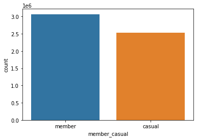
    


According to this plot
- the number of member is greater than the number of casual

### Factors that I need to show

##### Date by month


```python
# count member_casual
counts = Counter(data_2021['month'])
counts
```


    Counter({1: 96834,
             2: 49622,
             3: 228496,
             4: 337230,
             5: 531633,
             6: 729595,
             7: 822410,
             8: 804352,
             9: 756147,
             10: 631226,
             11: 359978,
             12: 247540})


```python
data_2021['month'].describe()
```


    count    5.595063e+06
    mean     7.418277e+00
    std      2.492260e+00
    min      1.000000e+00
    25%      6.000000e+00
    50%      8.000000e+00
    75%      9.000000e+00
    max      1.200000e+01
    Name: month, dtype: float64


```python
plt.figure(figsize=(10, 6))
sns.countplot(x='month', data=data_2021)
```


    <AxesSubplot:xlabel='month', ylabel='count'>


    
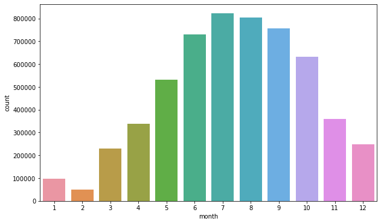
    


```python
plt.figure(figsize=(10, 6))
sns.countplot(x='month', data=data_2021, hue='member_casual')
```


    <AxesSubplot:xlabel='month', ylabel='count'>


    
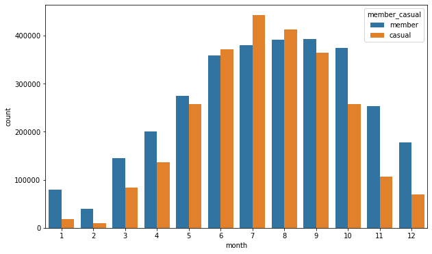
    


In my opinion
- the number of bike user is significantly increased at 3rd month (March)
    - Then it is significantly decreased at 11th month (November)


Resource: https://weatherspark.com/h/y/14091/2021/Historical-Weather-during-2021-in-Chicago-Illinois-United-States
- On March, Chicago temp was increased
- the month that has high temp would increase the number of bike user 
#### Conclusion, the temperature and the bike users have correlation each other 

In my opinion
- In the high temp month
    - the number of casual bike user is increased more than the number of member bike user
- people might prefer casual bike to member bike when they want to
    - bike for exercise
    - bike for chilling
    - what are reason?
        - user can set the bike manually?
        - the member bike is not comfortable as casual bike?
        
#### In conclusion, people prefer the casual bike when they want to ride for chilling or exercise

#### date by weekday


```python
counts = Counter(data_2021['weekday'])
counts
```


    Counter({'Saturday': 991047,
             'Wednesday': 756142,
             'Thursday': 737588,
             'Monday': 702588,
             'Sunday': 857285,
             'Friday': 810508,
             'Tuesday': 739905})


```python
data_2021['weekday'].describe()
```


    count      5595063
    unique           7
    top       Saturday
    freq        991047
    Name: weekday, dtype: object


```python
plt.figure(figsize=(10, 6))
sns.countplot(x='weekday', data=data_2021)
```


    <AxesSubplot:xlabel='weekday', ylabel='count'>


    

    


I need to sort the weekday by order in the week


```python
data_2021['weekday'] = pd.Categorical(data_2021['weekday'], 
                                      categories=['Monday', 'Tuesday', 'Wednesday', 'Thursday', 'Friday', 'Saturday', 'Sunday'], 
                                      ordered=True)
```


```python
plt.figure(figsize=(10, 6))
sns.countplot(x='weekday', data=data_2021)
```


    <AxesSubplot:xlabel='weekday', ylabel='count'>


    
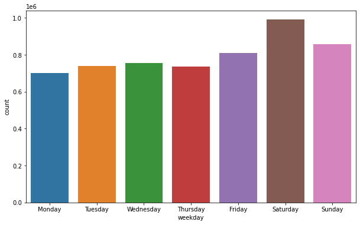
    


```python
plt.figure(figsize=(10, 6))
sns.countplot(x='weekday', data=data_2021, hue='member_casual')
```


    <AxesSubplot:xlabel='weekday', ylabel='count'>


    
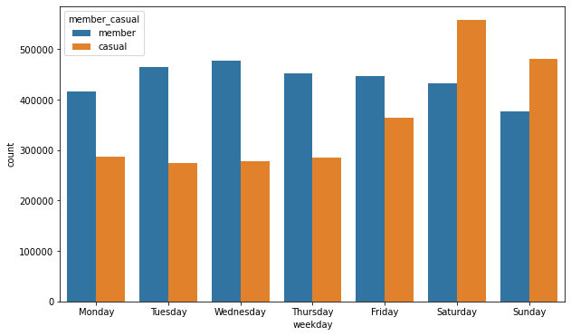
    


In my opinion
- Normally, Monday to Friday are the working day while Saturday and Sunday are the vacation day
- on the working day, people prefer member bike to casual bike
    - what does it mean?
        - the member bike is easy to use in the rush hour?
        - people just do not want to show their own bike when they go to work for some reason?
- on the vacation day, people prefer casual bike to member bike
    - what does it mean?
        - like an above reason that I said, for chilling or exercise
        
#### In conclusion, the working day and the vacation day have correlation with the number of member bike users

#### date by hours in a day + facet_wrap() each weekday


```python
counts = Counter(data_2021['start_hr'])
counts
```


    Counter({16: 462833,
             18: 485262,
             22: 170894,
             13: 351334,
             2: 38020,
             14: 353200,
             5: 42586,
             15: 389702,
             9: 207021,
             19: 360584,
             12: 342730,
             10: 233941,
             11: 291243,
             7: 196402,
             8: 236778,
             21: 201009,
             1: 61198,
             20: 253743,
             0: 87051,
             17: 556837,
             23: 125785,
             6: 107574,
             4: 18098,
             3: 21238})


```python
data_2021['start_hr'].describe()
```


    count    5.595063e+06
    mean     1.424177e+01
    std      5.052284e+00
    min      0.000000e+00
    25%      1.100000e+01
    50%      1.500000e+01
    75%      1.800000e+01
    max      2.300000e+01
    Name: start_hr, dtype: float64


```python
plt.figure(figsize=(10, 6))
sns.countplot(x='start_hr', data=data_2021)
```


    <AxesSubplot:xlabel='start_hr', ylabel='count'>


    

    


```python
plt.figure(figsize=(10, 6))
sns.countplot(x='start_hr', data=data_2021, hue='member_casual')
```


    <AxesSubplot:xlabel='start_hr', ylabel='count'>


    
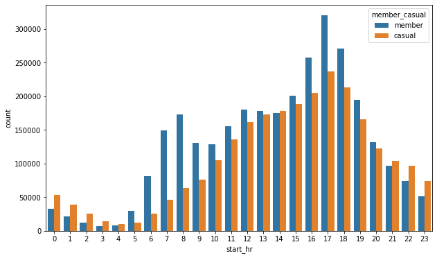
    


```python
#create multiple plot like facet wrap in R
plt.figure(figsize=(10, 6))
sns.catplot(x='start_hr', col='weekday', kind='count', data=data_2021, col_wrap=2)
```


    <seaborn.axisgrid.FacetGrid at 0x1de6c604340>


    <Figure size 720x432 with 0 Axes>


    
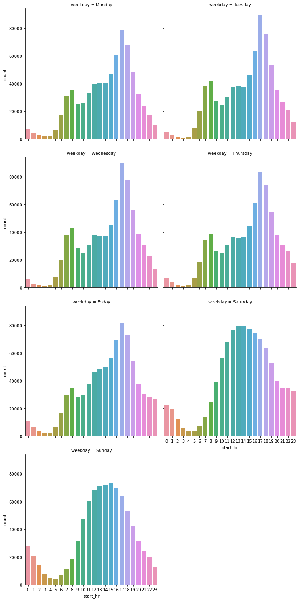
    


```python
plt.figure(figsize=(10, 6))
sns.catplot(x='start_hr', col='weekday', kind='count', data=data_2021, col_wrap=2, hue='member_casual')
```


    <seaborn.axisgrid.FacetGrid at 0x1de0839ba00>


    <Figure size 720x432 with 0 Axes>


    
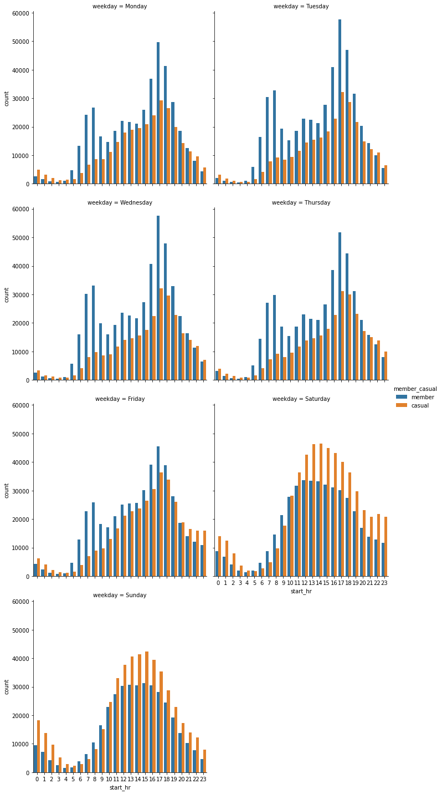
    


In my opinion
- On the working day
    - the number of bike user is significantly increased around 7 o'clock
        - especially the member bike
        - 7 o'clock is the time for going to work
    - the number of bike user is significantly increased around 17 o'clock
        - especially the member bike
        - 17 o'clock is the time to back to their home
- On the vacation day
    - the number of casual bike user is greater than the number member bike users
    - people like to use the bike around 9 o'clock to 20 o'clock

#### time to use

I need to convert time_to_use to minute unit


```python
# using timedelta.total_seconds() to convert time to second unit
data_2021['time_to_use'] = data_2021['time_to_use'].dt.total_seconds() / 60
```


```python
plt.figure(figsize=(10, 6))
sns.boxplot(x='time_to_use', y='member_casual', data=data_2021)
```


    <AxesSubplot:xlabel='time_to_use', ylabel='member_casual'>


    
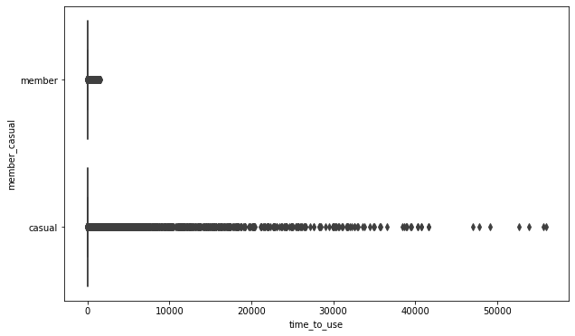
    


I suppose they are error or might be the accident when the team gathers data


```python
# using statistics to describe
mean_group = data_2021.groupby('member_casual')['time_to_use'].mean()
mean_group
```


    member_casual
    casual    32.000947
    member    13.632841
    Name: time_to_use, dtype: float64


```python
statistic_group = data_2021.groupby('member_casual')['time_to_use'].describe()
statistic_group
```


<div>
<style scoped>
    .dataframe tbody tr th:only-of-type {
        vertical-align: middle;
    }

    .dataframe tbody tr th {
        vertical-align: top;
    }

    .dataframe thead th {
        text-align: right;
    }
</style>
<table border="1" class="dataframe">
  <thead>
    <tr style="text-align: right;">
      <th></th>
      <th>count</th>
      <th>mean</th>
      <th>std</th>
      <th>min</th>
      <th>25%</th>
      <th>50%</th>
      <th>75%</th>
      <th>max</th>
    </tr>
    <tr>
      <th>member_casual</th>
      <th></th>
      <th></th>
      <th></th>
      <th></th>
      <th></th>
      <th></th>
      <th></th>
      <th></th>
    </tr>
  </thead>
  <tbody>
    <tr>
      <th>casual</th>
      <td>2529005.0</td>
      <td>32.000947</td>
      <td>263.143954</td>
      <td>-58.033333</td>
      <td>9.066667</td>
      <td>15.966667</td>
      <td>29.283333</td>
      <td>55944.150000</td>
    </tr>
    <tr>
      <th>member</th>
      <td>3066058.0</td>
      <td>13.632841</td>
      <td>27.705804</td>
      <td>-54.083333</td>
      <td>5.566667</td>
      <td>9.600000</td>
      <td>16.600000</td>
      <td>1559.933333</td>
    </tr>
  </tbody>
</table>
</div>


#### Because of many of error in the time to use section
- I might ignore about time to use
    - so when we need to present, I might do not include this part
- to clean this part
    - we should ask subject matter experts about proper range

#### type of bike


```python
# count member_casual
counts = data_2021.groupby(['rideable_type','member_casual']).size()
counts
```


    rideable_type  member_casual
    classic_bike   casual           1266657
                   member           1984371
    docked_bike    casual            312342
                   member                 1
    electric_bike  casual            950006
                   member           1081686
    dtype: int64


```python
# change appearance to unstack appearance
counts = counts.unstack()
counts = counts.reindex(['classic_bike', 'docked_bike', 'electric_bike'])
counts
```


<div>
<style scoped>
    .dataframe tbody tr th:only-of-type {
        vertical-align: middle;
    }

    .dataframe tbody tr th {
        vertical-align: top;
    }

    .dataframe thead th {
        text-align: right;
    }
</style>
<table border="1" class="dataframe">
  <thead>
    <tr style="text-align: right;">
      <th>member_casual</th>
      <th>casual</th>
      <th>member</th>
    </tr>
    <tr>
      <th>rideable_type</th>
      <th></th>
      <th></th>
    </tr>
  </thead>
  <tbody>
    <tr>
      <th>classic_bike</th>
      <td>1266657</td>
      <td>1984371</td>
    </tr>
    <tr>
      <th>docked_bike</th>
      <td>312342</td>
      <td>1</td>
    </tr>
    <tr>
      <th>electric_bike</th>
      <td>950006</td>
      <td>1081686</td>
    </tr>
  </tbody>
</table>
</div>


```python
plt.figure(figsize=(10, 6))
sns.countplot(x='rideable_type', data=data_2021)
```


    <AxesSubplot:xlabel='rideable_type', ylabel='count'>


    
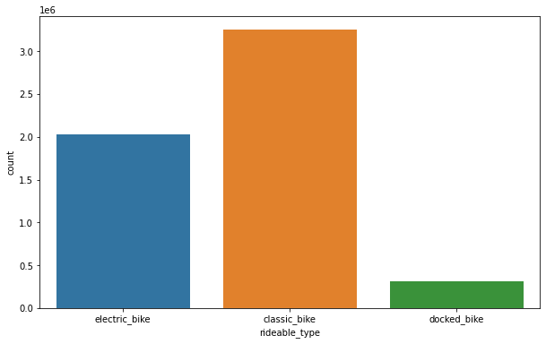
    


```python
plt.figure(figsize=(10, 6))
sns.countplot(x='rideable_type', data=data_2021, hue='member_casual')
```


    <AxesSubplot:xlabel='rideable_type', ylabel='count'>


    
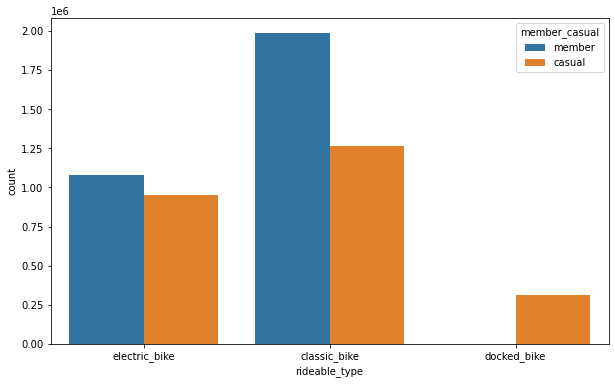
    


After try to sort + filter on csv file by using Exel
- I found that the docked bike for member is actual only 1!
    - It might because Cyclistic cancle the docked bike model?

According to above chart
- people are using classic bike most of all of 3 types
- member bikes do not have docked bike (only have 1)

## Sharing

#### How to share
- Presentation
    - create with canvas
    - create dashboard with tableau
    - ipykernel
- Platform
    - GitHub (Exactly)
    - Tableau : https://public.tableau.com/views/GoogleDataAnalyticsCase1/Dashboard1?:language=en-US&publish=yes&:display_count=n&:origin=viz_share_link

#### What do I get from this
- Correlation
    - temp & the number of bike user
        - high temp month -> high the number of bike user
    - activity & member or casual
        - chilling / normal activity / exercise -> prefer casual bike
        - in the rush hour -> prefer member bike
    - day & member or casual
        - the working day -> prefer member bike
        - the vacation day -> prefer casual day
- month and temp in Chicago
    - people using bike highest around July to Sep 
        - That in Summer in Chicago (May-Sep)
        - while Feb is lowest number because it had snowed in Chicago
- activity
    - Summer is good season for getting sunlight
        - increased casual bike
    - Winter is not good for riding your bike
        - people use member bike more than casual bike
            - especially in Feb, member bike users are vividly over casual bike users
    - in working day, the number of bike user is clearly increased around 7 o'clock
        - time to go work place
- day
    - in vacation day
        - the number of casual bike user is higher than the number of member bike user

## Acting

#### What should I recommend to marketing team?
- about month
    - In winter
        - we should keep many bikes to storage
            - decrease available bike because people bike in this season lowly
            - snow might damages the bike
            - save budget from taking care the bike in this season
    - In summer
        - we should increase available bikes
            - people like to bike in this season
            - good opportunity for getting return of investment
            - we should improve our bike that make people love to ride our bike for chill
- we should find out how to make customer use our bike in variant situation
    - not only in rush hour, but also in free time


```python

```
